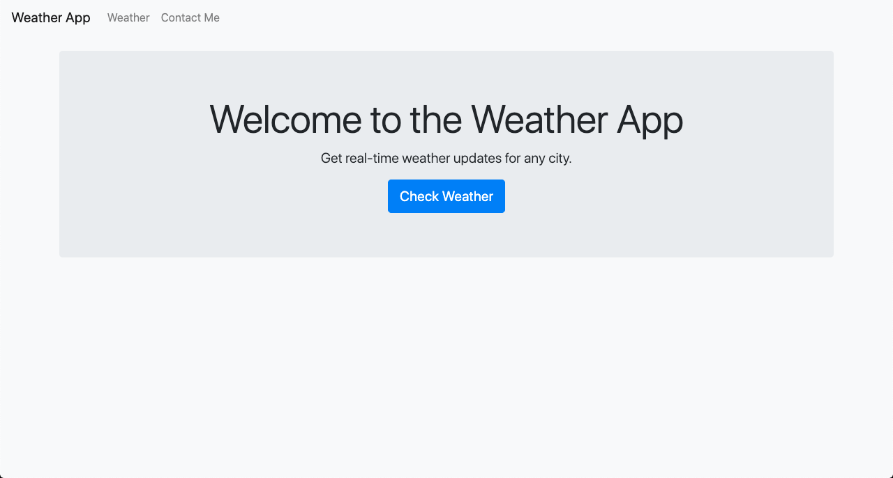
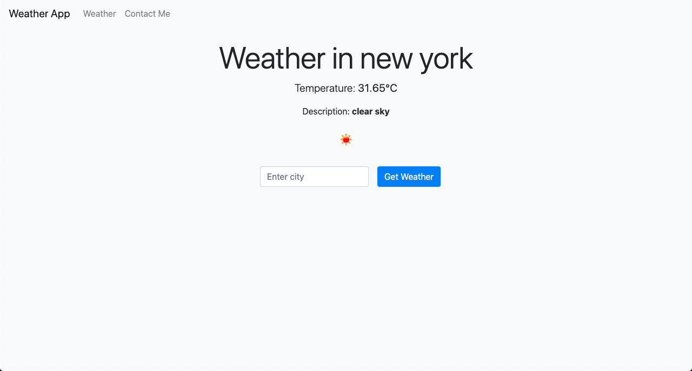

# Weather App

Welcome to the Weather App! This project provides real-time weather updates for any city around the world.

## Table of Contents

- [About the Project](#about-the-project)
- [Features](#features)
- [Installation](#installation)
- [Usage](#usage)
- [Screenshots](#screenshots)
- [Technologies Used](#technologies-used)
- [Contributing](#contributing)
- [License](#license)
- [Contact](#contact)

## About the Project

The Weather App is built using Django, a high-level Python web framework that encourages rapid development and clean, pragmatic design. It fetches weather data from the OpenWeatherMap API and displays it in a user-friendly interface.

## Features

- Real-time weather updates
- Search for weather by city
- Responsive design using Bootstrap
- Easy-to-use interface

## Installation

To get a local copy up and running follow these simple steps.

### Prerequisites

- Python 3.6 or higher
- Django 3.0 or higher

### Installation Steps

1. Clone the repository:
    ```bash
    git clone https://github.com/your-username/weather-app.git
    cd weather-app
    ```

2. Create a virtual environment:
    ```bash
    python -m venv .venv
    source .venv/bin/activate  # On Windows use `.venv\Scripts\activate`
    ```

3. Install the dependencies:
    ```bash
    pip install -r requirements.txt
    ```

4. Set up the database:
    ```bash
    python manage.py migrate
    ```

5. Run the development server:
    ```bash
    python manage.py runserver
    ```

6. Open your browser and go to `http://127.0.0.1:8000/`

## Usage

- On the home page, you can read about the project and its features.
- Navigate to the "Weather" page using the navbar to search for weather updates by city.
- Use the "Contact Me" page to get in touch with the project owner.

## Screenshots





## Technologies Used

- Django
- Python
- Bootstrap
- OpenWeatherMap API

## Contributing

Contributions are what make the open-source community such an amazing place to learn, inspire, and create. Any contributions you make are **greatly appreciated**.

1. Fork the Project
2. Create your Feature Branch (`git checkout -b feature/AmazingFeature`)
3. Commit your Changes (`git commit -m 'Add some AmazingFeature'`)
4. Push to the Branch (`git push origin feature/AmazingFeature`)
5. Open a Pull Request

## License

Distributed under the MIT License. See `LICENSE` for more information.

## Contact

Your Name - [your-email@example.com](mailto:your-email@example.com)

Project Link: [https://github.com/your-username/weather-app](https://github.com/your-username/weather-app)
